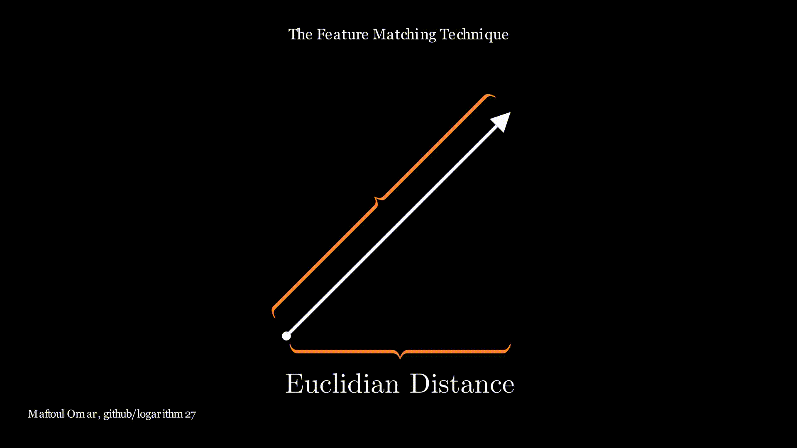
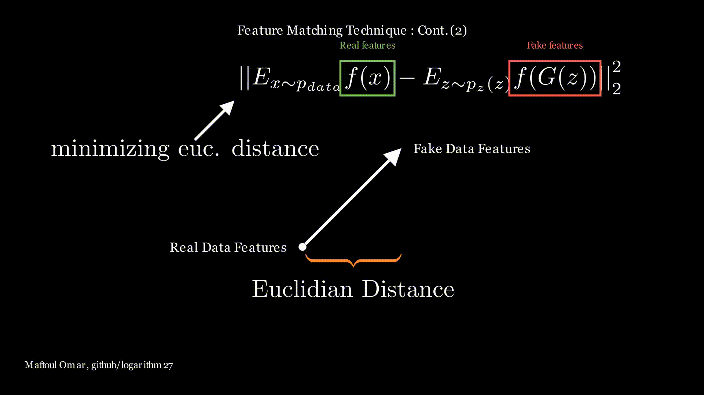

# Implementing Feature Matching technique from the paper "Improved Techniques for Training GANs"
### Images generated during semi-supervised model training :

### Losses and accuracy :

# The proposed techniques in the paper :

# The only technique implemented in the repo is the Feature Matching method :
### Feature Matching technique principle (1):

### Feature Matching technique principle (2):

# The Semi-Supervised Model: How it is built ? :
